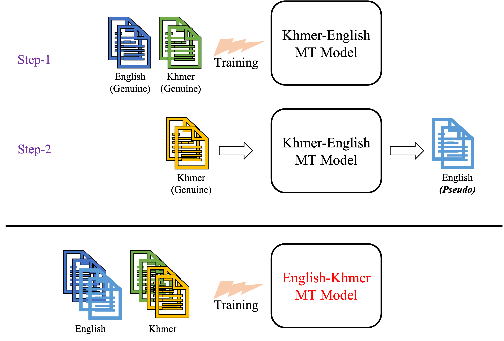

# Back-translation as Data Augmentation

## Why Data Augmentation?
A parallel corpus is required to train a model in a sequence-to-sequence task. 
For example, in the English-Khmer machine translation (MT) task, we need a parallel corpus that contains pairs of English sentences and their corresponding Khmer sentence.

However, creating a large-scale parallel corpus is not an easy process (human-created corpora are expensive and time-consuming!!!). 

To deal with such difficulties, people explore methods to generate pseudo-training data automatically and simultaneously use generated pseudo-data and genuine data to train a model.

## Back-translation
Back translation (BT) [(Sennrich et al., 2016a)](https://aclanthology.org/P16-1009) is a widely used method of creating pseudo-learning data, especially in machine translation task. Back-translation is also used in other sequence-to-sequence tasks such as grammatical error correction and summarization tasks ([Kiyono et al., 2019](https://aclanthology.org/D19-1119), [Parida et al., 2019](https://publications.idiap.ch/attachments/papers/2019/Parida_EMNLP2019_2019.pdf) ).

In the following explanation, we consider English-Khmer MT task as our main problem.

To augment training data with back-translation approach, first, we train an opposite direction MT model (i.e Khmer-English) using (little amount of ) genuine training data we have.

Next, we apply the trained Khmer-English model on genuine Khmer texts to generate pseudo English texts.

Finally, we use pairs of genuine Khmer texts and pseudo English texts as pseudo training data along with existing genuine training data.

Iterative version of back-translation is also reported effective to improve performance in machine translation tasks ([Hoang et al., 2018](https://aclanthology.org/W18-2703)).

Moreover, attaching additional token (e.g. `<Pseudo>`) to the beginning of pseudo pairs is empirically known effective to improve model performance ([Caswell et al., 2019](https://aclanthology.org/W19-5206)).



## Example
- Genuine Dataset
    - Khmer-English parallel (ALT) corpus from [WAT 2020](http://lotus.kuee.kyoto-u.ac.jp/WAT/km-en-data/)
    - 18K of genuine training pairs

- In this example, for simiplicity, we use the genuine Khmer texts in training set to generate pseudo English texts.
    - We generate pseudo English texts with various beam-width sizes.

- Please refer to [Machine Translation with Fairseq](README.md) to obtain dataset

### Baseline
- train English-Khmer MT model with genuine training data (18K)
- Please refer to [Machine Translation with Fairseq](README.md)

### Step-1: Train back-translation model (Khmer-English)
- train Khmer-English MT model with genuine training data (18K)

```
% PARA_DIR=mt-tutorial/wat2020.km-en/alt
% BIN_DIR=wat2020.km-en.alt.bin
% bash scripts/preprocess-km-en.sh $PARA_DIR $BIN_DIR

% BIN_DIR=wat2020.km-en.alt.bin
% MODEL_DIR=checkpoints-km-en
% LOG_FILE=wat2020.km-en.alt.transformer.log
% bash scripts/train-km-en.sh $BIN_DIR $MODEL_DIR $LOG_FILE
```

### Step-2: Generate pseudo data
- generate pseudo English text 
- we generate best 5 translations of each input in the following example

```
% PARA_DIR=mt-tutorial/wat2020.km-en/alt
% DICT_DIR=wat2020.km-en.alt.bin
% OUTPUT_BIN_DIR=wat2020.km-en.alt.genuine.km.bin
% bash scripts/preprocess-km.genuine.sh $PARA_DIR $DICT_DIR $OUTPUT_BIN_DIR

% BIN_DIR=wat2020.km-en.alt.genuine.km.bin
% MODEL=checkpoints-km-en/checkpoint_avg.pt
% OUTPUT_PREF=./output.best
% NBEST=5
% bash scripts/generate-en.pseudo.sh $BIN_DIR $MODEL $OUTPUT_PREF $NBEST
```
- extract generated translations and their genuine pairs

```
% cat $OUTPUT_PREF.beam.$NBEST.txt | grep '^H' | sed 's/^H\-//g' | sort -t ' ' -k1,1 -n | cut -f 3- > all-pseudo-output.txt
% cat $OUTPUT_PREF.beam.$NBEST.txt | grep '^S' | sed 's/^S\-//g' | sort -t ' ' -k1,1 -n | cut -f 2- > all-genuine-input.txt
% python scripts/match-genuine-pseudo-pair.py --genuine all-genuine-input.txt --pseudo all-pseudo-output.txt --nbest 5 --output-dir .
```

- tokenize pseudo pairs as subword (please refore to [Machine Translation with Fairseq](README.md))

```
% subword-nmt apply-bpe -c wat2020.km-en/alt/bpe16K.codes < bt.source.txt > wat2020.km-en/alt/train.pseudo.bpe16K.en

% subword-nmt apply-bpe -c wat2020.km-en/alt/bpe16K.codes < bt.target.txt > wat2020.km-en/alt/train.pseudo.bpe16K.km

```

- add generated pseudo training data to genuine training set

```
% GEN_SOURCE=wat2020.km-en/alt/train.alt.bpe16K.en
% GEN_TARGET=wat2020.km-en/alt/train.alt.bpe16K.km
% PSE_SOURCE=wat2020.km-en/alt/train.pseudo.bpe16K.en
% PSE_TARGET=wat2020.km-en/alt/train.pseudo.bpe16K.km
% python scripts/mix-genuine-pseudo.py --genuine-source $GEN_SOURCE --genuine-target $GEN_TARGET --pseudo-source $PSE_SOURCE --pseudo-target $PSE_TARGET --output-dir wat2020.km-en/alt/ --with-tag
```

- with 18K of genuine data and 90K (= 18K x 5) of pseudo data, now we have 108K training data

```
% wc -l wat2020.km-en/alt/train.alt.mixed.bpe16K.en
# 108528
% wc -l wat2020.km-en/alt/train.alt.mixed.bpe16K.km
# 108528
```

### After Data Augmentation
- retrain English-Khmer MT model with genuine + pseudo training data (=108K)
- Please refer to [Machine Translation with Fairseq](README.md)

### Result: Baseline vs. Afer Data Augmentation 


| Setting | BLEU4 |
| ------ | ------|
| Baseline | 23.72 |
| w/ BT | 25.67 |

### Some Translation Examples
------------------
------------------
Input:

`At 5:00 pm, California Governor Arnold Schwarzenegger, police and fire officials held a press conference.`

Reference:

`នៅ ម៉ោង 5:00 ល្ងាច អភិបាល រដ្ឋ កាលីហ្វរនីញ៉ា លោក អាណុល ឆវាសិនីជើ នគរ បាល និង មន្ត្រី ពន្លត់ អគ្គិ ភ័យ បាន រៀប ចំ សន្និសីទ ព័ត៌មាន មួយ ។
`

Output (baseline):

`
នៅ ម៉ោង 5:00 ល្ងាច អភិបាល រដ្ឋ កាលីហ្វតញ៉ា អាណុល ស្វ័រសិនីហ្គើ មន្ត្រី ប៉ូលីស និង ក្រុម មន្ត្រី អគ្គី ភ័យ បាន ប្រារព្ធ សន្និសីទ កាសែត មួយ ។
`

**Output-w/ BT**:

`នៅ ម៉ោង 5:00 ល្ងាច អភិបាល រដ្ឋ កាលីហ្វរញ៉ា អាណុល ស្វ័រសិនីហ្គើ និង មន្ត្រី អគ្គី ភ័យ បាន ប្រារព្ធ សន្និសីទ សារ ព័ត៌មាន មួយ ។
`

--------
--------

Input:

`Some observers think it is possible that the $100 barrier may be broken.
`

Reference:

`អ្នក អង្កេត ខ្លះ គិត ថា វា គឺ អាច ទៅ រួច ដែល ឧបសគ្គ 100 ដុល្លារ អាច នឹង ត្រូវ បាន បំបែក ។
`

Output (baseline):

`
អ្នក សង្កេត ការណ៍ មួយ ចំនួន គិត ថា វា អាច ទៅ រួច ដែល ថា បារ 100 លាន ផោន អាច នឹង ត្រូវ បាន បាត់ បង់ ។
`

**Output-w/ BT**:
	
`អ្នក អង្កេត ការណ៍ មួយ ចំនួន គិត ថា វា អាច ទៅ រួច ដែល ថា របាំង បង់ ប្រាក់ ចំនួន 100 ដុល្លារ អាច នឹង ត្រូវ បាន បម្លែង ។
`

--------
--------
Input:

`
In response to the deepening world financial situation, the Dutch government has this afternoon increased its savers protection from €38,000 to €80,000 effective immediately, to help secure the financial status of its savers within Holland.
`

Reference:

`
ដើម្បី ឆ្លើយ តប ទៅ នឹង ស្ថាន ភាព ហិរញ្ញ វត្ថុ ពិភព លោក ដ៏ តានតឹង នេះ កាល ពី រសៀល នេះ រដ្ឋាភិបាល ហុល្លង់ បាន បង្កើន ការ ការពារ អ្នក សន្សំ ប្រាក់ របស់ ខ្លួន ចាប់ ពី € 38,000 ទៅ € 80,000 ដែល មាន ប្រសិទ្ធិ ភាព ភ្លាម ៗ ដើម្បី ជួយ ធានា ស្ថាន ភាព ហិរញ្ញ វត្ថុ របស់ អ្នក សន្សំ ប្រាក់ របស់ ខ្លួន នៅ ក្នុង ប្រទេស ហុល្លង់ ។
`

Output (baseline):

`
ក្នុង ការ ឆ្លើយ តប ទៅ នឹង ស្ថាន ភាព ហិរញ្ញ វត្ថុ ពិភព លោក រដ្ឋាភិបាល ហូឡង់ រដ្ឋាភិបាល បាន កើន ឡើង នៅ រសៀល នេះ ការ ការពារ របស់ ខ្លួន ពី ការ ការពារ របស់ ខ្លួន ពី € 38,000 ដើម្បី ជួយ ធានា ធានា ធានា ធានា សុវត្ថិភាព ហិរញ្ញ វត្ថុ របស់ ក្រុម ហ៊ុន ហូលវេក នៅ ក្នុង ការ ស្តារ ឡើង វិញ ។
`

**Output-w/ BT**:
	
`
ក្នុង ការ ឆ្លើយ តប ទៅ នឹង ស្ថាន ភាព ហិរញ្ញ វត្ថុ ពិភព លោក រដ្ឋាភិបាល ហូឡង់ បាន កើន ឡើង នៅ រសៀល នេះ ការ ការពារ ជួយ សង្គ្រោះ បន្ទាន់ ពី € 38,000 ដល់ 80,000 អឺរ៉ូ ភ្លាម ៗ ដើម្បី ជួយ រក្សា ស្ថាន ភាព ហិរញ្ញ វត្ថុ របស់ ខ្លួន ក្នុង រយៈ ពេល មួយ ថ្ងៃ នេះ នៅ ក្នុង ហូលីស ។
`
